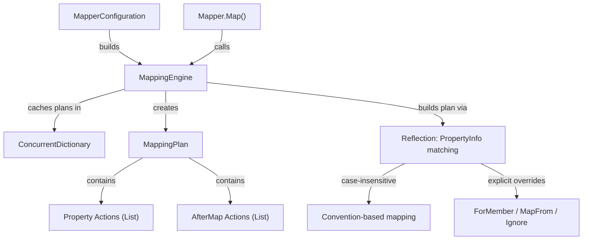

# CreateIfLabs.AutoMapper — Agent Knowledge Base

> **Purpose**: This document is for AI agents and developers who need to understand, extend, or debug this project.

---

## Project Intent

**CreateIfLabs.AutoMapper** is an open-source, drop-in replacement for [AutoMapper](https://automapper.org/). It replicates AutoMapper's public API and core runtime behavior so that consumers can swap the NuGet package reference and namespace without changing their application code.

### Why this exists

AutoMapper 16+ is a **paid, licensed** product. This library provides an open-source alternative for teams that:

- Need basic object-to-object mapping with convention-based property matching
- Use `Profile`, `ForMember`, `MapFrom`, `Ignore`, `AfterMap`, and DI integration
- Want to avoid AutoMapper licensing costs for straightforward mapping scenarios

### What this is NOT

- This is **not** a full AutoMapper replacement. Advanced features like `ProjectTo`, `ConstructUsing`, `ConvertUsing`, value converters, type converters, conditional mapping, and `BeforeMap` are **not implemented**.
- This is **not** performance-optimized via expression tree compilation. It uses reflection with plan caching.

---

## Architecture

### Namespace

All public types live in the `AutoMapper` namespace — this is intentional to enable drop-in replacement. The DI extensions live in `Microsoft.Extensions.DependencyInjection`.

### Project Structure

```
CreateIfLabs.AutoMapper/              # Library (netstandard2.1)
├── IMapper.cs                        # Core mapping interface
├── IConfigurationProvider.cs         # Creates IMapper instances
├── IMapperConfigurationExpression.cs # Fluent config API (CreateMap, AddProfile, AddMaps)
├── IMappingExpression.cs             # Per-map config (ForMember, AfterMap, ReverseMap)
├── IMemberConfigurationExpression.cs # Per-member config (MapFrom, Ignore)
├── IMappingAction.cs                 # DI-resolved post-mapping action interface
├── ResolutionContext.cs              # Context passed to AfterMap actions
├── Profile.cs                        # Abstract base class for organizing mappings
├── TypeMap.cs                        # Internal: TypeMap, MemberMap, MappingExpression impl
├── MapperConfigurationExpression.cs  # Internal: collects type maps and profiles
├── MapperConfiguration.cs            # Root config object, builds MappingEngine
├── Mapper.cs                         # Default IMapper impl, delegates to MappingEngine
├── MappingEngine.cs                  # Core engine: plan building, caching, execution
└── ServiceCollectionExtensions.cs    # DI: AddAutoMapper() overloads

CreateIfLabs.AutoMapper.Tests/        # Test suite (net10.0, xUnit v3)
├── MappingComparisonTests.cs         # 15 comparison tests
├── RealAutoMapperHelper.cs           # Reflection wrappers for real AutoMapper 16
├── Models/TestModels.cs              # Source/destination model classes
└── Actions/CombineFieldsAction.cs    # AfterMap action for DI testing
```

### Mapping Engine Design



**Key engine behaviors:**

| Behavior | Implementation |
|----------|---------------|
| Property matching | Case-insensitive name match between source and destination `PropertyInfo` |
| ForMember/MapFrom | Explicit `MemberMap` with compiled `Func<object, object, object>` resolver |
| Ignore | `MemberMap.Ignored = true` — skipped during plan execution |
| Nested objects | Recursive mapping when a `TypeMap` exists for the property types |
| Collections | Detects `IEnumerable<T>`, `List<T>`, `T[]` — maps element-wise using element `TypeMap` |
| Null propagation | Null source → null destination (reference types); null source properties → skip |
| AfterMap (lambda) | Stored as `Action<object, object, ResolutionContext>` on `TypeMap` |
| AfterMap (DI class) | Type stored on `TypeMap`, resolved via `serviceCtor` at execution time |
| Plan caching | `ConcurrentDictionary<(Type, Type), MappingPlan>` — built once, reused |

### DI Integration

`ServiceCollectionExtensions.AddAutoMapper()` provides 5 overloads mirroring AutoMapper:

| Overload | What it does |
|----------|-------------|
| `AddAutoMapper(Action<IMapperConfigurationExpression>)` | Manual config action |
| `AddAutoMapper(params Assembly[])` | Scan assemblies for `Profile` subclasses |
| `AddAutoMapper(params Type[])` | Scan assemblies of marker types |
| `AddAutoMapper(Action, params Assembly[])` | Config action + assembly scan |
| `AddAutoMapper(Action, params Type[])` | Config action + marker type scan |

**Registrations:**
- `MapperConfiguration` → Singleton
- `IConfigurationProvider` → Singleton (forwards to `MapperConfiguration`)
- `IMapper` → Transient (uses `IServiceProvider` for `AfterMap` action resolution)

---

## Test Strategy

### Comparison Approach

Tests compare **our library's output** against **real AutoMapper 16.0.0** for identical inputs and configurations. This ensures behavioral parity.

### Namespace Conflict Resolution

Since both libraries use the `AutoMapper` namespace, the real AutoMapper NuGet package is referenced with `ExcludeAssets="compile"`. This makes real AutoMapper types available only at runtime, not at compile time. Our library's types are used during compilation.

### Reflection Wrappers

`RealAutoMapperHelper.cs` contains typed wrapper classes that interact with the real AutoMapper entirely via reflection:

| Wrapper | Wraps |
|---------|-------|
| `RealConfigExpr` | Real `IMapperConfigurationExpression` |
| `RealMappingExpr<S,D>` | Real `IMappingExpression<S,D>` |
| `RealMemberConfigExpr<S>` | Real `IMemberConfigurationExpression` |
| `RealMapperWrapper` | Real `IMapper` |

> [!IMPORTANT]
> AutoMapper 16 requires a non-null `ILoggerFactory` in its `MapperConfiguration` constructor. The test helper provides `LoggerFactory.Create(_ => { })`.

### Test Coverage

| # | Scenario | vs Real AM |
|---|----------|:---:|
| 1 | Basic property mapping | ✅ |
| 2 | ForMember + MapFrom (string concat) | ✅ |
| 3 | ForMember + Ignore | ✅ |
| 4 | Nested object mapping | ✅ |
| 5 | Collection mapping (`List<T>`) | ✅ |
| 6 | AfterMap lambda | ✅ |
| 7 | AfterMap action class (DI) | Library only |
| 8 | Null source → null | ✅ |
| 9 | Null nested property | ✅ |
| 10 | Map into existing instance | ✅ |
| 11 | Map into existing (null source) | ✅ |
| 12 | DI registration + resolution | Library only |
| 13 | Multiple AfterMap hooks (ordering) | Library only |
| 14 | Nested null inner | ✅ |
| 15 | DI assembly scanning | Library only |

---

## How to Extend

### Adding a New Mapping Feature

1. Add the API surface to the relevant interface (e.g. `IMappingExpression<S,D>`)
2. Implement in `MappingExpression<S,D>` (in `TypeMap.cs`) — store config on `TypeMap` or `MemberMap`
3. Handle in `MappingEngine.BuildPlan()` and/or `MappingEngine.ExecutePlan()`
4. Add a comparison test in `MappingComparisonTests.cs`
5. If the real AutoMapper supports it, add reflection wrapper support in `RealAutoMapperHelper.cs`

### Adding New Test Models

Add new model classes to `Models/TestModels.cs`. Keep source and destination types separate (no shared base classes) to mirror real-world usage patterns.

---

## Known Limitations

- No `ProjectTo<T>()` (IQueryable projection)
- No `ConstructUsing` / `ConvertUsing`
- No value/type converters
- No `BeforeMap` hooks
- No conditional mapping (`Condition`, `PreCondition`)
- No `IncludeBase` / `IncludeDerived` inheritance mapping
- No flattening (e.g. `Order.Customer.Name` → `CustomerName`)
- No `MaxDepth` or `PreserveReferences` for circular references
- Reflection-based engine (no expression tree compilation for performance)

---

## Build & Test

```bash
# Build everything
dotnet build

# Run tests (15 tests, ~1 second)
dotnet test CreateIfLabs.AutoMapper.Tests/CreateIfLabs.AutoMapper.Tests.csproj

# Build library only
dotnet build CreateIfLabs.AutoMapper/CreateIfLabs.AutoMapper.csproj
```

### Dependencies

| Project | Target | Key Dependencies |
|---------|--------|-----------------|
| Library | `netstandard2.1` | `Microsoft.Extensions.DependencyInjection.Abstractions` 9.0.0 |
| Tests | `net10.0` | `AutoMapper` 16.0.0 (runtime only), `xunit.v3`, `Microsoft.Extensions.DependencyInjection`, `Microsoft.Extensions.Logging` |
